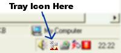



## Darrens Hotkeys

### Description

Darrens Hotkeys.

This program is to assign the windows key with another key on your keyboard to a program, so when you hit the two keys at any time while your computer is on the program assigned will open.

I use it all the time.

See Screenshot.
 
### More Info
 

             |
---                |---
**Submitted On**   |2002-07-10 22:21:10
**By**             |[CoderFromHell](https://github.com/Planet-Source-Code/PSCIndex/blob/master/ByAuthor/coderfromhell.md)
**Level**          |Advanced
**User Rating**    |5.0 (30 globes from 6 users)
**Compatibility**  |VB 5\.0, VB 6\.0
**Category**       |[Complete Applications](https://github.com/Planet-Source-Code/PSCIndex/blob/master/ByCategory/complete-applications__1-27.md)
**World**          |[Visual Basic](https://github.com/Planet-Source-Code/PSCIndex/blob/master/ByWorld/visual-basic.md)
**Archive File**   |[Darrens\_Ho1046327102002\.zip](https://github.com/Planet-Source-Code/coderfromhell-darrens-hotkeys__1-36783/archive/master.zip)

